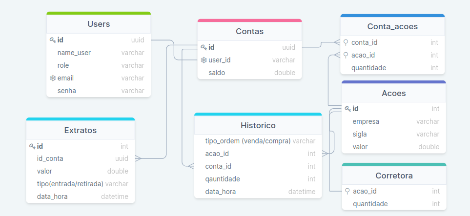

# Boas-vindas ao repositório do desafio XP

Esse projeto é a execução da solução de um caso apresentado pela empresa XP.

Trata-se de uma API para o gerenciamento de contas e compras de ações.

Aqui você vai encontrar os detalhes de como executar-lo localmente, as decisões tomadas para a resolução e detalhes sobre as rotas.

O Deploy da API foi hospedado na plataforma Heroku no seguinte endereço: 

https://bazlerativos.herokuapp.com/

<br />

# Instruções de execução

1. Clone o repositório.
  * `git clone git@github.com:eduardobazler/desafioXP.git`.

2. Instale as dependências.
  * `npm install`

3. Crie um arquivo .env na raiz do projeto e insira as variáveis de ambiente como descrito no arquivo .env.example.

4. Caso não exista o banco de dados, rode o comando abaixo que irá criar um novo banco de dados com o nome colocado no arquivo .env .
  * `npx sequelize db:create`

5. Após a certificação da existência do banco de dados, rode o comando abaixo para fazer as migrações necessárias.
  * `npx sequelize db:migrate`

6. Para popular o banco, inicialmente, rode o comando abaixo.
  * `npx sequelize db:seed:all`

7. Após a certificação dos passos acima rode o comando abaixo para iniciar a aplicação. 🚀
  * `npm start`


8. Para o ambiente de desenvolvimento, existe a opção abaixo, que irá verificar as alterações do código e recarregá-lo automaticamente.

  Certifique-se de instalar as dependências de desenvolvimento.
  * `npm run dev`

9. Para a execução dos testes, rode o comando abaixo.

  Certifique-se de instalar as dependências de desenvolvimento.
  * `npm test`

10. Para verificar a cobertura dos testes rode o comando abaixo

  Certifique-se de instalar as dependências de desenvolvimento.
  * `npm run test-coverage`

<br />

# Descrição das tomadas de decisões e abordagens do problema

  Modelo do banco de dados: 

  

  A decisão dessa modulação, consiste nas seguintes ideias:

  * Cada usuário tem suas informações de acesso em uma tabela única, tabela Users, separando a responsabilidade das entidades que lidam com a conta das que lidam com as informações de acesso.


  * Cada usuário tem uma Conta única que se relaciona de forma única com a tabela de Users, criando uma relação de 1:1 entre a tabela Users e Contas, onde se encontra o seu saldo bancário.


  * A tabela Acoes contém as informações das ações, o código único da ação, empresa, tag e valor.


  * A tabela Conta_acoes contém a relação da Conta com a Ação, suportando a relação de N:N entre a tabela Acoes com a tabela Contas, trazendo a quantidade dessa relação.


  * A tabela Corretora contém a quantidade de ações que a corretora possui, criando uma relação de 1:1.

  * A tabela Historico guarda as informações da compra ou da venda de uma ação, registrando o tipo, venda ou compra, o código da ação, o código da conta, a quantidade comprada ou vendida e a data que isso ocorreu.
    
  * A tabela Extrato se refere as transações de saques e depósitos na conta do usuário, guardando as informações do código da conta, valor da tranferência, o tipo, saque ou depósito, e a data. 

<br />


## Rotas e descrição das funcionalidades

### * Importante:
  - Todas as requisições do tipo POST contém um middleware que valida o formato das informações requiridas no body.
  - Caso não esteja no formato esperado isso irá retornar um erro.
  - Todas as rotas, com exceção da rota user para criar um novo usuário, deve conter o token no header na chave authorization.
  - Todos os erros retornados serão no seguinte formato:

    ```json
      {
        "message": "mensagem de erro",
      }
    ```

### 1 - User POST `/user`

- A rota recebe uma requisição POST para a criação de um novo usuário.
- É esperado da requisição as informações de email, nome do usuário e senha dentro do body da requisição no seguinte formato:
    ```json
      {
        "userName": "nome do usuário",
        "email": "usuario@email.com",
        "password": "123456",
      }
    ```
- Com a criação do usuário, será criada uma conta vinculada com o id do usuário.
- O retorno de sucesso traz o id da nova conta no seguinte formato:

    ```json
      {
        "contaId": "662e8847-f1fa-4489-b556-60ba24c79cf6",
        "email": "usuario@email.com",
        "userName": "nome do usuário"
      }
    ```
---

### 2 - Auth POST `/auth`
- A Rota Auth recebe uma requisição POST com os dados de email e senha do usuário para login no sistema, retornando uma chave Token de acesso.
    ```json
      {
        "userName": "nome do usuário",
        "email": "usuario@email.com",
        "password": "123456",
      }
    ```
- O Retorno do token será no seguinte formato:
    ```json
      {
        "token": "token do usuario"
      }
  ```
---

### 3 - Rotas de investimentos POST `/ivestimentos/{comprar||vender}`

- Na rota de compra e de venda o body esperado na requisição do tipo POST é do seguinte formato:
- Para essas duas rotas é necessário o token de validação, pois existe um middleware que controla o acesso.
- A contaId é do tipo uuid, a acaoId e a qtdeAcao é do tipo inteiro.
    ```json
      {
        "contaId": "662e8847-f1fa-4489-b556-60ba24c79cf6",
        "acaoId": 1,
        "qtdeAcao": 100
      }
    ```
- Na compra de uma ação ocorre as seguintes verificações:
  1. Se a Corretora contém a quantidade requerida.
  2. Se a conta do usuário possui saldo suficiente para a compra da quantidade.

- Após passar por essas checagens, a compra é efetuada, atualizando a quantidade de ações do usuário, da corretora e atualizando o saldo do usuário.

- Na venda de uma ação ocorre as seguintes verificações:
  1. Se o Usuário contém a quantidade disponível para a venda.

- Após passar por essa checagem, a venda é efetuada, atualizando a quantidade de ações do usuário e da corretora.

- O retorno dessas operações é do seguinte formato: 
    ```json
      {
        "contaId": "662e8847-f1fa-4489-b556-60ba24c79cf6",
        "acaoId": 1,
        "qtdeAcao": 100,
        "status": "executada"
      }
    ```
---

### 4 - Rotas de Conta POST `/conta/{deposito||saque}`

- Na rota de depósito e saque o body esperado na requisição do tipo POST é do seguinte formato:
- Para essas duas rotas é necessário o token de validação, pois existe um middleware que controla o acesso.
- A contaId é do tipo uuid e o valor é do tipo decimal

    ```json
      {
        "contaId": "662e8847-f1fa-4489-b556-60ba24c79cf6",
        "valor": 100.00,
      }
    ```
- Na rota de depósito é atualizado o valor do saldo da conta do usuário.
- Na rota de saque existe a validação para verificar se a conta pertence ao usuário. Somente com essa validação é atualizado o saldo do usuário.

- O retorno das duas rotas é do seguinte formato: 

    ```json
      {
        "contaId": "662e8847-f1fa-4489-b556-60ba24c79cf6",
        "valor": 100.00,
        "status": "{saque||deposito} executado"
      }
    ```
---

### 5 - Rotas de conta GET  `/conta/:contaId`

- Essa rota retorna o saldo da conta do usuário passado pelo parâmetro da URL.
- Para essa rota é necessário o token de validação, pois existe um middleware que controla o acesso.
- É efetuada a verificação se a conta no parâmetro pertence ao usuário logado.
- Após a verificação o retorno da rota é do seguinte formato: 

    ```json
      {
        "contaId": "662e8847-f1fa-4489-b556-60ba24c79cf6",
        "saldo": 100.00
      }
    ```
---

### 6 - Rotas de conta GET  `/conta/ativos/:contaId`

- Essa rota retorna a lista dos ativos que pertencem a conta passada no parâmetro da URL.
- Para essa rota é necessário o token de validação, pois existe um middleware que controla o acesso.
- É efetuada a verificação se a conta no parâmetro pertence ao usuário logado.
- Após a verificação o retorno da rota é do seguinte formato: 

    ```json
      {
        "contaId": "0874183a-c82d-43a3-9b4d-3a576d008f50",
        "acoes": [
          {
            "id": 1,
            "company": "Vale",
            "tag": "VALE3",
            "value": 33.56,
            "ContaAcoes": {
              "quantity": 15
            }
          },
          {
            "id": 2,
            "company": "Alphabet",
            "tag": "GOGL34",
            "value": 72.56,
            "ContaAcoes": {
              "quantity": 25
            }
          }
        ]
      }
    ```
---

### 7 - Rotas de ativos GET  `/ativos`

- Essa rota retorna todos os ativos que a corretora possui com suas informações.
- Para essa rota é necessário o token de validação, pois existe um middleware que controla o acesso.
- O retorno da rota é do seguinte formato: 

    ```json
        [
          {
            "acaoId": 1,
            "quantity": 1000,
            "acao": {
              "company": "Vale",
              "tag": "VALE3",
              "value": 33.56
            }
          },
          {
            "acaoId": 2,
            "quantity": 3000,
            "acao": {
              "company": "Alphabet",
              "tag": "GOGL34",
              "value": 72.56
            }
          },
          {
            "acaoId": 3,
            "quantity": 5000,
            "acao": {
              "company": "Natura",
              "tag": "NTCO3",
              "value": 17.56
            }
          }
        ]
    ```
---

### 8 - Rotas de ativos GET  `/ativos/:acaoId`

- Essa rota retorna um único ativo, através do código recebido no parâmetro da URL.
- Para essa rota é necessário o token de validação, pois existe um middleware que controla o acesso.
- O retorno da rota é do seguinte formato: 

    ```json
        {
          "acaoId": 2,
          "quantity": 3000,
          "acao": {
            "company": "Alphabet",
            "tag": "GOGL34",
            "value": 72.56
          }
        }
    ```
---

### 9 - Rotas de ativos POST `/ativos`

- Para essa rota é necessário o token de validação, pois existe um middleware que controla o acesso.
- Essa rota só pode ser acessada por um usuário do tipo admin, existe um middleware de validação que confere qual é a categoria do usuario através do token.
- Essa rota cria um novo ativo, que recebe as informações no seguinte formato:

    ```json
      {
        "company": "XPInc",
        "tag": "XPTO",
        "value": 100.00,
        "quantity": 5000,
      }
    ```
- Na rota de depósito é atualizado o valor do saldo da conta do usuário.
- Na rota de saque existe a validação se a conta pertence ao usuário. Somente com essa validação é atualizado o saldo do usuário.

- O retorno dessa rota é do seguinte formato: 

    ```json
      {
        "acaoId": 1,
        "company": "XPInc",
        "tag": "XPTO",
        "quantity": 5000,
      }
    ```
---

